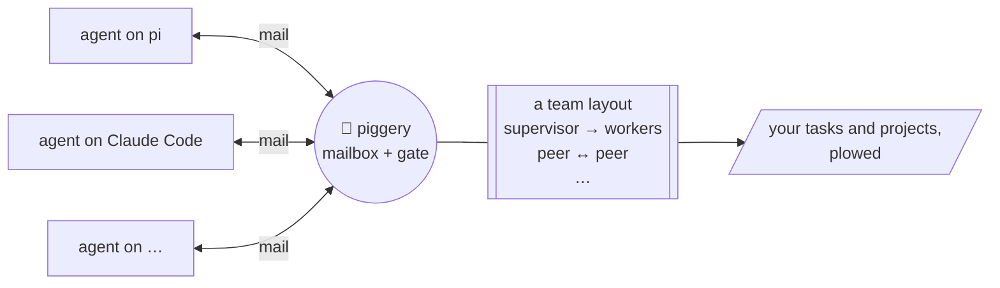

# Piggery 🐖 - Lợn cày tasks

Your coding agents are pigs. Piggery is the farm.

Work goes into a pig's trough and waits there until the pig is back. It only counts as eaten
when the job is actually done, not when the pig sniffed at it. Every pig also has a pen: its
role says who it may talk to and whether it may have piglets (workers). The farm checks the
fence itself, so no amount of sweet talk gets a pig through it.

pi, Claude Code, Codex, omp and dsh pigs all live on the same farm and talk to each other. The
farm is one Go binary and a SQLite file, and nothing runs in the cloud.


## How it works



Every agent gets the same mailbox, whatever its harness: a pi session can mail a Claude Code
session, and a worker's answer wakes whoever is waiting for it. Each mail and each spawn passes
the gate, which checks it against the team's layout: a small YAML file you pick or write. A few
come built in as examples (`supervisor-executor`, `slp`, `council`, `p2p`); any other shape is
another file.

## Harnesses

| Harness | Your sessions | Workers piggery starts | Tested with | Add piggery |
|---|---|---|---|---|
| [pi](https://github.com/earendil-works/pi) | yes (extension) | yes (`pi --mode rpc`) | 0.87.1 | `piggery setup pi` |
| [Claude Code](https://claude.com/product/claude-code) | yes (plugin + MCP) | yes (`claude -p`) | 2.1.283 | `piggery setup claude` |
| [Codex](https://github.com/openai/codex) | yes (hooks + MCP) | yes (`codex app-server`) | 0.157.1 | `piggery setup codex` |
| [omp](https://github.com/can1357/oh-my-pi) | yes (extension) | yes (`omp --mode rpc`) | 18.4.2 | `piggery setup omp` |
| [dsh](https://github.com/deepseek-ai/deepseek-harness) | yes (`dsh web`, plugin) | yes (`dsh --profile sdk`) | 0.2.0-rc.1 | `piggery setup dsh` |

A role's workers run on the harness its template names (`spawn.harness`), else on the one of the
session that founded the team. `piggery setup` alone shows each harness's version and whether
piggery is installed in it.

## Install

```sh
curl -fsSL https://raw.githubusercontent.com/omaika/chick-farm/main/install.sh | sh
piggery setup pi       # and/or: claude, codex, omp, dsh
```

On Windows (PowerShell):

```powershell
irm https://raw.githubusercontent.com/omaika/chick-farm/main/install.ps1 | iex
piggery setup pi
```

The script picks the build for your OS and CPU (Linux, macOS or Windows, amd64 or arm64), checks it
against the release's `checksums.txt`, and installs it in `~/.local/bin` (`PIGGERY_INSTALL_DIR` to
change it, `PIGGERY_VERSION=v0.3.0` for a given release). By hand: download `piggery-<os>-<arch>`
(`darwin-arm64`, `darwin-amd64`, `linux-amd64`, `linux-arm64`, `windows-amd64.exe`,
`windows-arm64.exe`) from the [latest release](https://github.com/omaika/chick-farm/releases/latest),
`chmod +x` it (not on Windows) and put it on your PATH.

On Windows the daemon listens on a named pipe instead of `~/.piggery/piggery.sock`, and
`piggery setup notify add` is not available (its hooks are sh scripts): put your own `.cmd`, `.ps1`
or `.exe` hook in `~/.piggery/hooks/notify.d/`.

Using [Paseo](https://paseo.sh)? `piggery setup paseo` adds a Piggery view (the same as
`piggery top`) to the app. Turn on plugins in Paseo's settings once.

Rather a browser? `piggery web --open` serves `piggery top` at http://127.0.0.1:4125: the same
rows, Overview and Tail, kill and the model picker, and a Mail tab with each participant's or team's
messages (reading them acks nothing). It listens on loopback only (`--addr 127.0.0.1:PORT` for
another port), and the page carries a token made at each start.

Or build it: `go install github.com/sting8k/piggery/cmd/piggery@latest` (Go 1.26+).
`piggery update` installs a newer release. Every release has a `checksums.txt`; what changed is in
[CHANGELOG.md](CHANGELOG.md).

## Quick start

1. Open pi, Claude Code, Codex, omp or `dsh web` in your project.
2. Ask it for a team: *"make a supervisor-executor team to fix the failing tests"*.
3. Watch the farm: `piggery top`, or `piggery web --open` in the browser.

More: [docs/guide.md](docs/guide.md) covers running teams, watching and stepping in, and customizing
`~/.piggery` (config, templates, worker profiles, your own rules); [docs/reference.md](docs/reference.md)
lists every command, config key, profile key and manifest key.

## Farm layouts

| Template | Who does what |
| --- | --- |
| `supervisor-executor` | A supervisor splits the goal into checkable tasks; executors do them. |
| `slp` | You steer a supervisor; each lane has a lead and peers, often in its own git worktree. |
| `council` | A chair asks members for independent views on one hard decision. |
| `p2p` | Peers that talk freely and spawn more peers. |

Make your own: `piggery template new mine --from slp`, then edit
`~/.piggery/templates/mine/manifest.yaml` (see the [guide](docs/guide.md#customize-piggery-piggery)).

## Build from source

```sh
go build ./cmd/piggery
go test ./...
```

## License

MIT
