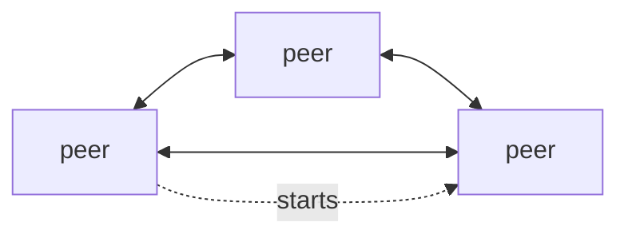
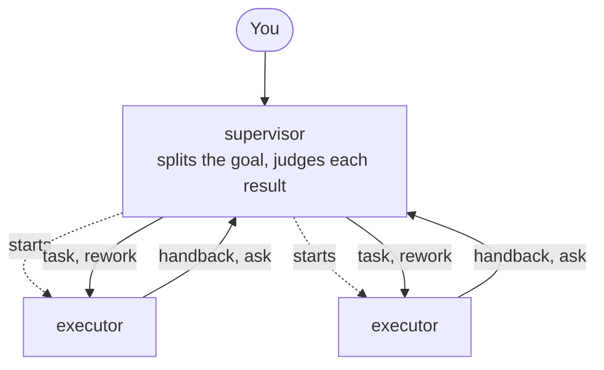
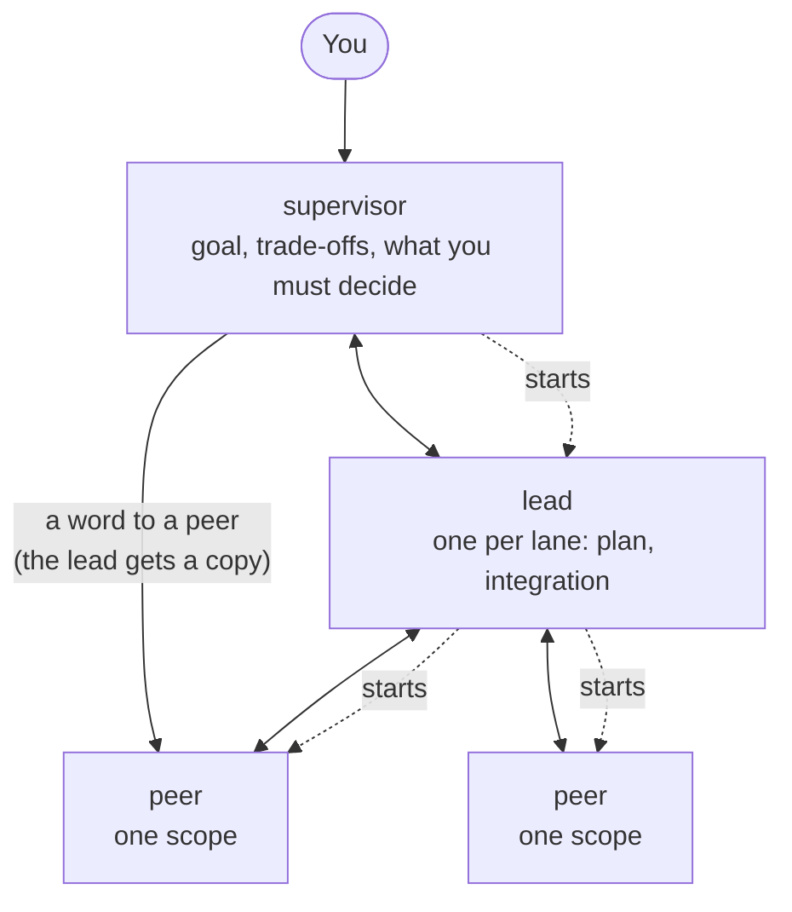
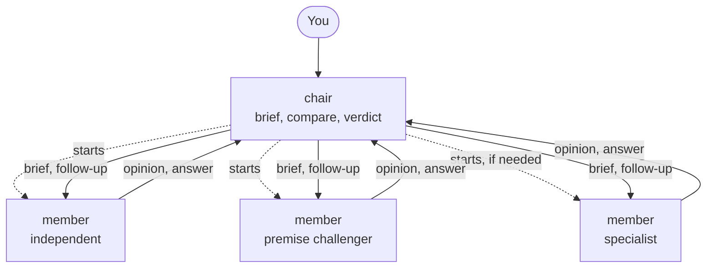
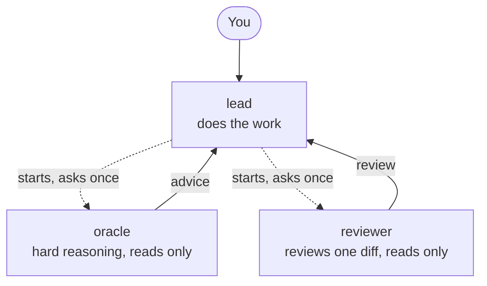
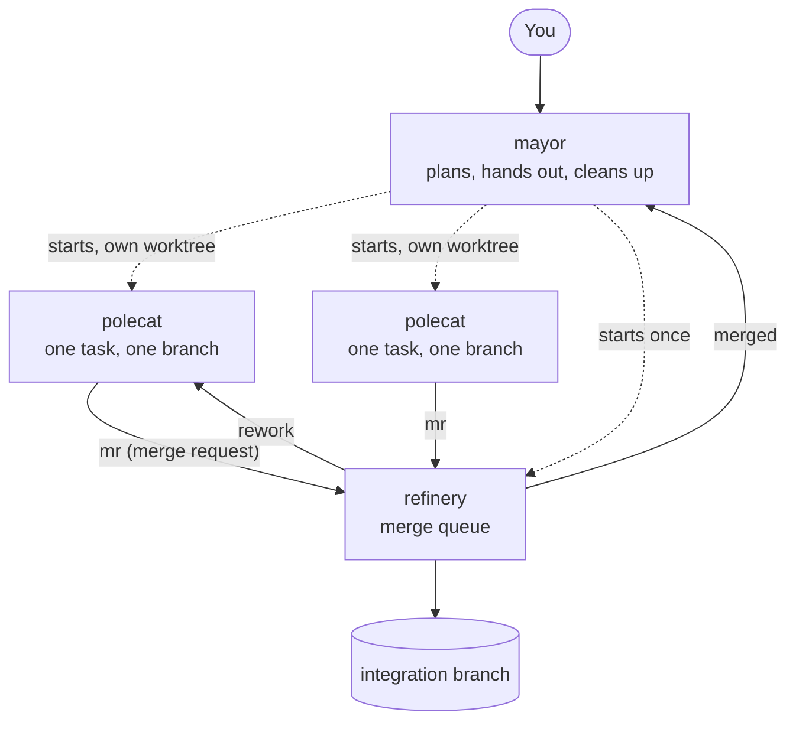

# The built-in team templates

A template is a small YAML file that says who is on a team, who may start whom, and who may write
to whom. piggery enforces the last two; the role prompts ask for the rest. This page shows each
built-in template as a picture, with when it fits.

How to read the diagrams: a box is a role. A solid arrow is "may send mail to". A dotted arrow is
"may start (spawn)". You talk to the role at the top, usually the session you opened yourself.
Anyone not connected by an arrow cannot reach the other, and that is on purpose.

| Template | Pick it when |
| --- | --- |
| [`p2p`](#p2p) | You want no structure at all, or a starting point for your own |
| [`supervisor-executor`](#supervisor-executor) | You have a goal that splits into checkable tasks, and you want someone to judge each one |
| [`slp`](#slp) | The work is big enough for lanes, each with its own plan, and you want to steer from above |
| [`council`](#council) | You face one hard decision and want independent opinions before choosing |
| [`amp-like`](#amp-like) | You want to do the work in one session and call a second brain now and then |
| [`gastown-like`](#gastown-like) | Several coding tasks can run at once on separate branches and need merging |

Start one with `piggery --admin team up <template>`, or let your session found it. Copy one to
change it: `piggery template new mine --from <template>`.

## p2p

No roles, no rules beyond the limits. Every peer can talk to every peer and start more peers.
Good for trying piggery out, for a few equals working side by side, or as the plain base for a
template of your own.

## supervisor-executor

A foreman and a crew. The supervisor never does the work itself: it cuts your goal into small
tasks, each with a check that proves it done, hands them out, and reads every result. A result
that misses the check goes back with a note (`rework`). Executors can argue with a task mid-way;
that is welcome.

Executors cannot talk to each other. Anything they need from one another goes through the
supervisor, which keeps one view of the whole job. A second executor only starts when two tasks
can really run side by side.

## slp

Supervisor, Lead, Peer. Think of a project with lanes: one lane per part that can move and be
checked on its own (often one git worktree per lane). You settle the goal and the trade-offs with
the supervisor. Each lane gets a lead, who owns its plan and puts the pieces together. Peers each
own one scope inside the lane, and may push back on the plan with evidence.

The supervisor may tell a peer something directly, but the lead always gets a copy, so the lane's
plan stays in one place. One lane is the default; more lanes only when the parts really are
separate.

## council

A panel for one hard question. The chair writes a neutral brief and starts one member per angle
(by default: one who reasons from first principles, one who challenges the question itself, and a
domain specialist only when a domain's rules decide it). Members never see each other's answers.
The chair compares them, asks one follow-up where they really disagree, and gives you a verdict
with the dissent and what would reopen it.

The council ends at the verdict. If you then want it carried out, say so, or use another template
for the doing.

## amp-like

After [Amp](https://ampcode.com)'s main agent with its oracle and code reviewer. You work with the
lead, which does the job itself. When it needs a harder think (a plan, a bug it is stuck on) it
starts an oracle; when a change deserves a second look it starts a reviewer. Each specialist
answers once and is stopped. The next question gets a fresh one, with a brief that carries what
was said before.

It pays off most when the specialists run a different model family from the lead, so they
actually think differently:

- the oracle: a strong reasoning model of another family (a `gpt-*` model when the lead runs
  `claude-*`, and the other way round), with a high thinking level;
- the reviewer: a third family if you have one (`gemini-*`).

Set them in `roles.oracle.spawn.model`, `roles.oracle.spawn.thinking` and
`roles.reviewer.spawn.model`, written the way that role's harness names models and levels.

## gastown-like

After [Gas Town](https://github.com/gastownhall/gastown)'s mayor, polecats and refinery. A small
coding factory: the mayor cuts your goal into tasks that touch different files, gives each its own
branch and worktree, and a polecat to do it. Finished branches queue up at the refinery, which
merges them one at a time into an integration branch and runs the tests after each. A branch that
conflicts or breaks the tests is undone and sent back to its polecat.

The mayor gets a copy of every merge request and every rework, so it always knows where each task
stands. Your own branch never moves by itself: when everything has landed on the integration
branch, the mayor tells you, and you decide. Gas Town's watchdog agents are left out; piggery
already tells the mayor when a member goes quiet.

## Limits every template has

Each template also sets a few guard rails: how deep a chain of starts may go (`depth`), how many
workers may run at once (`concurrency`), how much mail one member may send per minute, and timers
that tell a member's boss when it has been silent too long. Every key is in the
[reference](../docs/reference.md#manifest).
